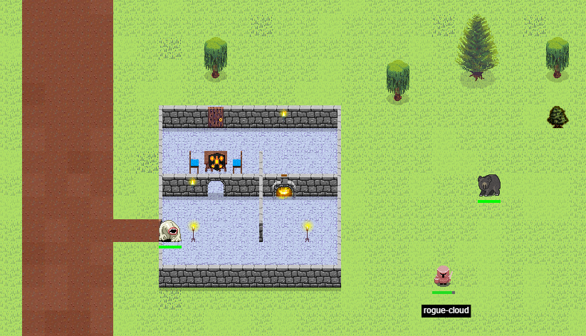

## Introduction

Rogue Cloud is an open-world top-down 2D multiplayer game, but unlike a traditional game where you control it with a controller, keyboard, or mouse, with Rogue Cloud you are actually writing code to control your character as it interacts with a vast, dangerous game world. Behind the scenes the code that you write is packaged into a WebSocket-based microservice, which like a traditional microservice, provides or supports a variety of cloud-native requirements.

## Getting Started

Start playing the game by visiting our docs:
* [Getting Started](docs/GettingStarted.md)
* [Introduction and Concepts](docs)

Developer documentation for folks interested in how it's implemented, or adding new features to the game:
* [Introduction to Rogue Cloud Development](docs/RogueCloudDevelopment.md)

##  The Technology Behind the Game

Building microservices and cloud-native applications requires tools that lets developers rapidly develop and deploy applications to the cloud.
  * Learn more about **Eclipse Codewind**, our [open source container-based development tools driving end-to-end delivery and rapid iteration of Node/Java/Swift/Go/Python/Docker application development](https://www.eclipse.org/codewind/).

Rogue Cloud is built on **Open Liberty**, the premier platform for building Java cloud-native applications and microservices.
  * Learn more about our latest and greatest [open source enterprise application server](https://openliberty.io/).

Rogue Cloud is designed to showcase the capabilities of the **IBM Cloud Pak for Applications** and the public **IBM Cloud Kubernetes Service** services.
  * Learn more about deploying to Kubernetes using the [IBM Cloud Pak for Applications](https://www.ibm.com/cloud/cloud-pak-for-applications) and the [IBM Cloud Kubernetes Service](https://www.ibm.com/cloud/container-service) services.

## Playing the game

Have we piqued your interest? Learn more about the game and then get started playing! See [Getting Started](docs/GettingStarted.md) to begin.

