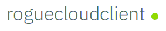

## Play Rogue Cloud from Eclipse

### A) Install Eclipse
- If you already have Eclipse installed, skip to the next section. Microclimate Developer Tools for Eclipse requires either Eclipse Photon, Eclipse 2018-09, or newer.

1) Visit the [Eclipse download page](https://www.eclipse.org/downloads/packages/).
2) Locate the 'Eclipse IDE for Enterprise Java Developers' section, select your operating system, then click Download.
3) Wait for the file to download, then extract it to the directory of your choice.
4) Start Eclipse, specify a workspace directory (the default is fine), and wait for Eclipse to load.


### B) Installing Microclimate Developer Tools into Eclipse
- Requires either Eclipse Photon.0, Eclipse 2018-09, or newer.

1) From within Eclipse, select `Help` > `Eclipse Marketplace`.
2) Type `Microclimate` in the search bar, then click `Go`.
3) You should now see `Microclimate Developer Tools` in the search listings. Click the `Install` button.
4) Read and accept the licenses, then click `Finish`.
5) After the install completes, you will be prompted to restart Eclipse, click Restart.


### C) Install and start Microclimate, if not already done.

See section.


### D) Clone the Rogue Cloud Client Git Repo from the Microclimate browser UI

1) In the [Microclimate browser UI](http://localhost:9090), accept the Microclimate license and telemetry pages. You should now see the Microclimate introductory splash screen.
2) Select the ``Import Project`` button. On the following page, select ``Git``, then copy paste the following repository location:
* `https://github.com/microclimate-dev2ops/rogue-cloud-client`
3) Click ``Next``, then click the ``Import`` button.
4) Once the code is imported, click the ``Edit Code`` button. You are now redirected to the code editor.
5) Before you start building the code, the container needs to initialize and download the Java and Maven dependencies for the underlying build system. This can take up to 7-10 minutes depending on CPU and network connection (this initialization is only required the first time you using Microclimate). You can use ``docker logs -f microclimate-file-watcher`` to watch its progress.
6) Once the build has initialized and downloaded the required dependencies, the build icon displays a green circle notification, like so: 

Once the build completes, you can now return to the Eclipse window.

### D) Create a dev connection to Microclimate from Eclipse

You should now have both Eclipse and Microclimate installed. Next we need to configure the Eclipse Microclimate Developer Tools to connect to the Microclimate service.

Ensure that Microclimate is started.

1) In Eclipse, select `File` (menu item) > `New` > `Other`. This will bring up the `New` wizard dialog. 
2) Under the `Microclimate` category, select `New Microclimate Connection`, then click `Next`. 
3) Click `Test connection` to confirm that Eclipse can connect to your local Microclimate instance, then `Finish`.
4) The `Microclimate Explorer` view should appear at the bottom of the screen, and should show the `roguecloudclient` application running inside Microclimate.
5) Right-click on `roguecloudclient` and select `Import project`.
	- The Git repository on which the project is based will be imported into Eclipse.
	- The `roguecloudclient` source will be imported into Eclipse as a Maven project.


### E) Register a user and then make changes to the SimpleAI class

1) In the code editor, hit ``CTRL-SHIFT-R`` (``Command-Shift-R`` on Mac) and type ``StartAgentServlet.java``, and select ``StartAgentServlet.java``.
* ``CTRL-SHIFT-R/Command-Shift-R`` is a great way to quickly find Java classes in Eclipse.

2) Edit the following fields in `StartAgentServlet.java` to create a new user and password.
```
public static final String USERNAME = "(specify a username here!)";
public static final String PASSWORD = "(specify a password here!)";
```
* These values are to ensure that *only you* can access and control your character. 
* The username and password you specify are automatically registered when your code first begins controlling a character on the game map, and they do not have to correspond to an existing email address or account.


### F) Next steps: watch your agent go, and start coding

To watch your agent as it interacts with the game world, right click on the `roguecloudclient` project in the `Microclimate Explorer` view and select `Open Application`.

This will open a browser to the root of your application.

Add ``gameclient/StartAgent`` to the end of the URL, such that it looks like:
* ``http://localhost:(port)/gameclient/StartAgent``
* where (port) is the randomly generated local port for the server.

Congratulations, your character is now exploring and interacting with the game world, and earning you points on the leaderboard!

Next, [visit the next steps page to learn more about coding an agent for Rogue Cloud.](Developing-CodingNextSteps.md)
