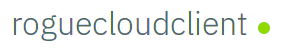

## Installing Microclimate and importing Rogue Cloud

### A) Download and Install Microclimate

 First, visit the [Installing Microclimate](Installing-Microclimate.md) page to install and start Microclimate. Return to this page when done.
 
### B) Clone the Rogue Cloud Client Git Repo from the Microclimate browser UI

1) In the [Microclimate browser UI](http://localhost:9090), accept the Microclimate license and select an option on the telemetry page. You should now see the Microclimate introductory splash screen.
2) Select the ``Import Project`` button. On the following page, select ``Git``, then copy and paste the following repository location:
* `https://github.com/microclimate-dev2ops/rogue-cloud-client`
3) Click ``Next``, then click the ``Import`` button.
4) Once the code is imported, click the ``Edit Code`` button. You are now redirected to the code editor.
5) Before the code starts building, the container needs to initialize and download the Java and Maven dependencies for the underlying build system. This can take up to 7-10 minutes depending on CPU and network connection (this initialization is only required the first time you using Microclimate). You can use ``docker logs -f microclimate-file-watcher`` to watch its progress.
6) Once the build has initialized and downloaded the required dependencies, the build icon displays a green circle notification, like so: 


### C) Register a user and then make changes to the SimpleAI class

1) In the code editor, hit ``CTRL-P`` (``Command-P`` on Mac) and type ``StartAgentServlet.java``, and select ``StartAgentServlet.java``.
* ``CTRL-P/Command-P`` is a great way to quickly find Java classes in the Microclimate code editor.
* *Note*: You *might* need to click inside the code editor for this shortcut key to work.

2) Edit the following fields to create a new user and password.
```
public static final String USERNAME = "(specify a username here!)";
public static final String PASSWORD = "(specify a password here!)";
```
* The username and password you specify are automatically registered when your code first begins controlling a character on the game map.

3) In the code editor, hit ``CTRL-S`` (``Command-S`` on Mac) in order to save your changes

4) Hit ``CTRL-P`` (on Mac, use ``Command-P``) and type ``SimpleAI.java`` and select ``SimpleAI.java``.

5) This class is the main AI class. Changes made to this class are reflected in your AI running on the Liberty Server.

### D) Next steps: watch your agent go, and start coding

To watch your agent as it interacts with the game world, switch to the ``Open app`` tab. You see a URL at the top of the page:

Add ``gameclient/StartAgent`` to the end of the URL, such that it looks like:
* ``http://localhost:(port)/gameclient/StartAgent``
* where (port) is the randomly generated local port for the server.

Congratulations, your character is now exploring and interacting with the game world, and earning you points on the leaderboard!

Next, [visit the next steps page to learn more about coding an agent for Rogue Cloud.](Developing-CodingNextSteps.md)
